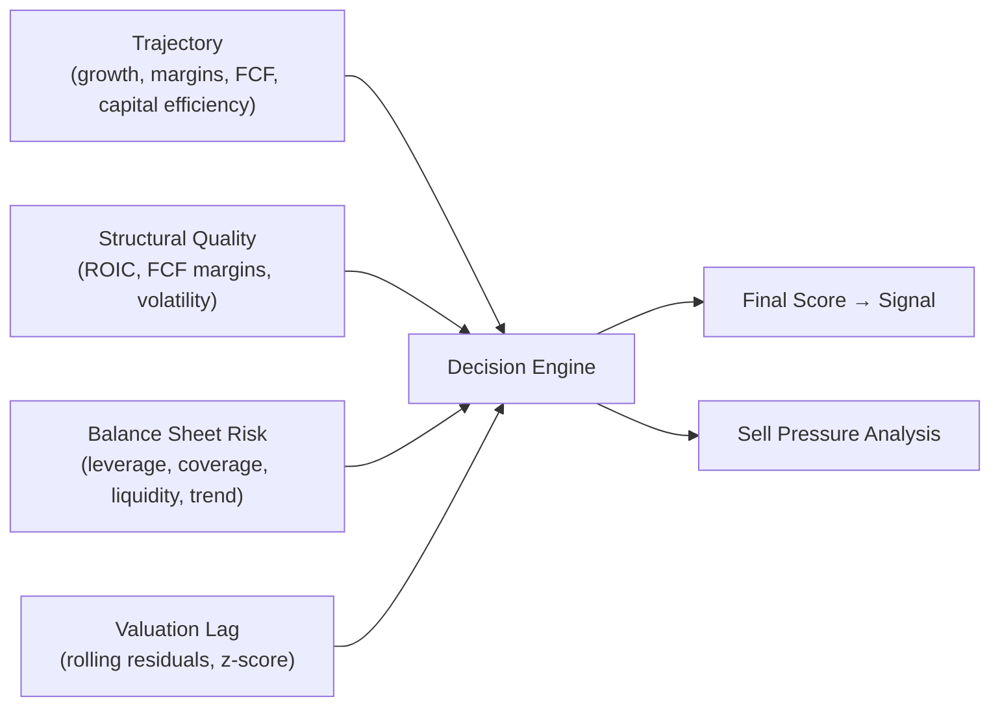

# Stock Analysis Engine — Deep Quantitative Review & Improvement Plan

## Architecture Summary

Your system follows a clean **4-pillar → weighted composite → signal** architecture:



Data flows through [coreAnalysis.ts](file:///Users/simonastamkevicius/Desktop/StockUniverse/stock-analysis/lib/coreAnalysis.ts), which computes TTM series, windows them, and passes windowed data into each pillar scorer. The [decisionEngine.ts](file:///Users/simonastamkevicius/Desktop/StockUniverse/stock-analysis/lib/decisionEngine.ts) normalizes pillar scores, weights them (45% growth, 35% structural, 20% balance sheet for the fundamental side, then 50/50 fundamentals vs. valuation), and emits buy/sell signals.

---

## Critical Findings & Improvement Proposals

### 1. Slope Estimation Is Fragile — Replace with Robust Regression

**Problem:** [calculateSlope](file:///Users/simonastamkevicius/Desktop/StockUniverse/stock-analysis/lib/helpers/slopeCalculation.ts#L1-L24) uses OLS on raw index values. This is heavily influenced by outliers (one bad quarter distorts the entire slope) and doesn't account for heteroskedasticity in financial data.

**Proposed Fix — Theil-Sen Estimator + R² Confidence:**

The Theil-Sen estimator takes the **median of all pairwise slopes** between data points, making it resistant to up to 29% outlier contamination:

```
slope = median({ (y_j - y_i) / (j - i)  |  i < j })
```

Additionally, attach an **R² value** (coefficient of determination) to every slope so downstream scoring can weight confident trends more than noisy ones.

> [!IMPORTANT]
> This single change affects **every pillar** — growth momentum, margin dynamics, FCF trajectory, capital efficiency, debt trend, and valuation lag all call [calculateSlope](file:///Users/simonastamkevicius/Desktop/StockUniverse/stock-analysis/lib/helpers/slopeCalculation.ts#1-25). The improvement propagates everywhere.

**Impact:** Reduces false trajectory signals in volatile stocks (biotech, commodity cyclicals, early-stage growth).

---

### 2. Structural Quality Scoring Ignores Trend Velocity and Confidence

**Problem:** [quality.ts](file:///Users/simonastamkevicius/Desktop/StockUniverse/stock-analysis/lib/quality.ts) uses static threshold-based scoring for ROIC and FCF margins (`avgROIC > 0.4 → 3 pts`). Two problems:
1. A company with ROIC declining from 50% → 22% still scores `+2` — no penalty for deterioration rate.
2. Binary trend checks (`isImprovingMargins`) compare only the latest value to the window average; this is trivially fooled by a single good quarter after a long decline.

**Proposed Fix — Exponential Trend Scoring:**

Replace the binary trend check with a slope-weighted **velocity term**:

```
trendScore = sign(slope) × min(1, |slope| / threshold) × R²
```

This continuously scales reward/penalty by how fast and how confidently the metric is moving. A company with rock-solid margins and a slight upward drift scores better than one with wildly oscillating margins that just happened to tick up.

Additionally, incorporate **coefficient of variation** (CV = σ/μ) alongside raw standard deviation for margin stability. A company with 40% FCF margins ± 5% is far more stable than one with 15% ± 5%, but raw σ treats them identically.

---

### 3. Valuation Lag Model — Missing Cointegration, Over-Reliance on a Single Residual

**Problem:** [valuationLag.ts](file:///Users/simonastamkevicius/Desktop/StockUniverse/stock-analysis/lib/valuationLag.ts) computes rolling OLS residuals of `logMultiple ~ fundamentalComposite`, then takes the z-score of the latest residual as the bias signal. Issues:

1. **Non-stationarity risk:** If the fundamental composite and log multiple are both trending (almost always true), OLS on non-stationary series gives spurious regressions. The residuals drift instead of mean-reverting.
2. **Single-point z-score fragility:** The entire valuation call rests on `zResidual[last]`. A single noisy month can flip the signal from "undervalued" to "overvalued."

**Proposed Enhancement — Engle-Granger Cointegration Test + Smoothed Residual:**

```
Step 1: Test if logMultiple and fundamentalComposite are cointegrated
         (ADF test on the residuals — if p > 0.10, the relationship is spurious)
Step 2: If cointegrated, use an Exponentially Weighted Moving Average (EWMA)
         of the residual z-score rather than a point estimate:
         
         z_smoothed(t) = λ · z(t) + (1 - λ) · z_smoothed(t-1),  λ ≈ 0.3
         
Step 3: Attach a confidence weight based on the cointegration t-statistic
```

This avoids the two worst failure modes: (a) generating strong signals on a spurious regression and (b) whipsawing on month-to-month noise.

**Simpler Alternative:** Even without the full cointegration test, replacing the raw `zResidual[last]` with a 3-month EMA of z-scores would dramatically reduce whipsaw:

```typescript
const smoothedZ = exponentialSmooth(zResidual, 0.3);
const rawBias = smoothedZ[smoothedZ.length - 1];
```

---

### 4. Decision Engine Weighting Is Static — Introduce Regime-Adaptive Weights

**Problem:** The [decision engine](file:///Users/simonastamkevicius/Desktop/StockUniverse/stock-analysis/lib/decisionEngine.ts#L226-L241) uses fixed weights (`0.45 × growth + 0.35 × structural + 0.20 × balance`), and a fixed 50/50 split between fundamentals and valuation. This is suboptimal because:

- In **rising-rate environments**, balance sheet risk should dominate (overweight to 30-40%)
- In **momentum regimes**, growth trajectory matters more than valuation
- In **mean-reversion regimes** (late cycle), valuation lag should be weighted higher

**Proposed Fix — Volatility-Regime Conditional Weights:**

Use realized volatility of the market or the stock as a regime proxy:

| Regime | σ_annualized | Growth Weight | Structural Weight | Balance Weight | Valuation Weight |
|--------|-------------|--------------|-------------------|----------------|-----------------|
| Low-vol expansion | < 15% | 0.50 | 0.30 | 0.10 | 0.40 |
| Normal | 15–25% | 0.45 | 0.35 | 0.20 | 0.50 |
| High-vol contraction | > 25% | 0.30 | 0.25 | 0.35 | 0.60 |

The volatility is already computed in [exitBoundaryHelpers.ts](file:///Users/simonastamkevicius/Desktop/StockUniverse/stock-analysis/lib/helpers/exitBoundaryHelpers.ts) via [computeAnnualizedVolatility](file:///Users/simonastamkevicius/Desktop/StockUniverse/stock-analysis/lib/helpers/exitBoundaryHelpers.ts#8-54). It's trivial to pass that into the decision engine.

---

### 5. Growth Momentum — Missing Acceleration (Second Derivative)

**Problem:** [scoreGrowthMomentum](file:///Users/simonastamkevicius/Desktop/StockUniverse/stock-analysis/lib/trajectory.ts#L33-L67) only measures first-order slope of growth rates. It can't distinguish between:
- A stock **accelerating** at an increasing rate (e.g., slope = +0.02 and increasing each quarter)
- A stock with flat high growth that's about to mean-revert

**Proposed Fix — Second-Derivative Growth Scoring:**

Compute `Δ(slope)` — the rate of change of the growth rate slope. This is the **acceleration** of growth:

```
acceleration = slope(growthRates[recent_half]) - slope(growthRates[older_half])
```

Score adjustments:
- `acceleration > 0` while `slope > 0` → bonus (+1): growth is **compounding**
- `acceleration < 0` while `slope > 0` → warning: growth decelerating, inflection point approaching
- `acceleration < 0` while `slope < 0` → severe: accelerating decline

This is the financial analogue of the second derivative test from calculus — identifying inflection points before they manifest in first-order metrics.

---

### 6. Fundamental Composite — Suboptimal Weighting Scheme

**Problem:** The [buildFundamentalComposite](file:///Users/simonastamkevicius/Desktop/StockUniverse/stock-analysis/lib/helpers/valLagHelper.ts#L196-L224) uses static weights [(0.35 growth + 0.25 margin + 0.20 ROIC + 0.20 FCF margin)](file:///Users/simonastamkevicius/Desktop/StockUniverse/stock-analysis/lib/helpers/timeWindow.ts#26-29) across all companies. However:
- For **asset-light businesses** (SaaS), FCF margins and ROIC are the key signals
- For **capital-intensive businesses** (industrials), margin dynamics and capital efficiency matter most
- For **high-growth pre-profit**, revenue growth dominates everything

**Proposed Fix — Sector-Adaptive Composite Weights:**

At minimum, detect the business type from the data itself (no external sector data needed):

```typescript
const isHighGrowth = recentGrowth > 0.25;
const isAssetLight = avgFCFMargin > 0.20 && avgROIC > 0.25;

const weights = isHighGrowth
  ? { growth: 0.50, margin: 0.20, roic: 0.10, fcf: 0.20 }
  : isAssetLight
  ? { growth: 0.25, margin: 0.20, roic: 0.30, fcf: 0.25 }
  : { growth: 0.30, margin: 0.30, roic: 0.20, fcf: 0.20 };  // capital-intensive default
```

---

### 7. Exit Boundary Model — Missing Jump-Diffusion for Tail Risk

**Problem:** [exitBoundary.ts](file:///Users/simonastamkevicius/Desktop/StockUniverse/stock-analysis/lib/exitBoundary.ts) uses pure GBM (`dS = μS dt + σS dW`). GBM underestimates tail risk because it assumes continuous paths — no jumps. In practice, stocks gap down 10-30% on earnings misses, FDA rejections, or macro shocks.

**Proposed Enhancement — Merton Jump-Diffusion:**

The Merton (1976) model adds a Poisson jump process to GBM:

```
dS/S = (μ - λk) dt + σ dW + J dN
```

Where:
- [N(t)](file:///Users/simonastamkevicius/Desktop/StockUniverse/stock-analysis/lib/helpers/math.ts#23-27) is a Poisson process with jump intensity `λ` (expected ~1-2 jumps/year for typical stocks)
- `J` is the jump size, typically log-normally distributed with mean `μ_J ≈ -0.05` and `σ_J ≈ 0.10`

The **modified lower boundary** becomes:

```
lower = S₀ × exp(drift_term - z × σ_effective × √T)
```

Where `σ_effective² = σ² + λ × (μ_J² + σ_J²)`, incorporating the additional variance from jumps.

**Practical implementation:** Estimate `λ` from historical monthly returns — count the months where |log-return| > 2σ, and use that frequency as the jump intensity. This leverages data already available in the system.

---

### 8. Rolling Z-Score Window — Fixed Window Causes Regime Blindness

**Problem:** [rollingZScore](file:///Users/simonastamkevicius/Desktop/StockUniverse/stock-analysis/lib/helpers/math.ts#L48-L75) uses a fixed-length window. In fast-moving markets, the window is too long (includes stale data from a different regime). In stable markets, it's appropriate.

**Proposed Fix — Adaptive Window via CUSUM Change Detection:**

Use a CUSUM (Cumulative Sum) detector to identify regime change-points in the residual series, and reset the z-score window at each detected change:

```
S_t = max(0, S_{t-1} + (x_t - μ) - k)

if S_t > h:
    regime_change detected → reset window start to t
```

Where `k` (sensitivity) and `h` (threshold) control the detector. This is a standard sequential analysis technique from quality control, adapted for financial time series.

**Simpler Alternative:** Use an expanding window with exponential decay weights, so older observations contribute less:

```typescript
function ewmaZScore(values: number[], lambda: number = 0.94) {
  let ewmaMean = values[0];
  let ewmaVar = 0;
  return values.map((v, i) => {
    if (i === 0) return 0;
    ewmaMean = lambda * ewmaMean + (1 - lambda) * v;
    ewmaVar = lambda * ewmaVar + (1 - lambda) * (v - ewmaMean) ** 2;
    const ewmaStd = Math.sqrt(ewmaVar);
    return ewmaStd > 0 ? (v - ewmaMean) / ewmaStd : 0;
  });
}
```

The RiskMetrics `λ = 0.94` is a well-proven industry standard.

---

### 9. Missing Module — Earnings Quality / Accrual Signal

**Problem:** The system has no accrual-based quality check. Academic research (Sloan 1996, Richardson 2005) consistently shows that **high-accrual companies** (earnings far exceeding cash flow) underperform by 5-8% annually.

**Proposed New Module — `earningsQuality.ts`:**

Compute the **accrual ratio**:

```
accrualRatio = (netIncome_TTM - operatingCashFlow_TTM) / totalAssets
```

Scoring:
| Accrual Ratio | Score | Meaning |
|--------------|-------|---------|
| < -0.05 | +2 | Cash-rich, high-quality earnings |
| -0.05 to 0.05 | +1 | Normal |
| 0.05 to 0.10 | 0 | Mild accrual concern |
| > 0.10 | -1 | Aggressive accounting, poor cash conversion |

All the data needed (net income, operating cash flow, total assets) is already available in the quarterly reports being fetched.

---

### 10. Missing Signal — Price Momentum / Relative Strength

**Problem:** The system analyzes **fundamental** trajectories but ignores **price** trajectories. Jegadeesh & Titman (1993) and Carhart (1997) established that 6-12 month price momentum is one of the strongest cross-sectional return predictors.

**Proposed Enhancement — Momentum Signal in Trajectory Pillar:**

Compute 6-month and 12-month price momentum from the existing `monthlyPrices`:

```
mom_6m  = (price[t] / price[t-6])  - 1
mom_12m = (price[t] / price[t-12]) - 1
```

Composite momentum score:
- `0.6 × mom_12m + 0.4 × mom_6m` (12-month is more robust)
- Exclude the most recent month (Jegadeesh-Titman recommends 12-1 or 6-1 to avoid short-term reversal)

This directly uses data already in the pipeline (`finalPrices`).

---

## Prioritized Implementation Roadmap

| Priority | Change | Effort | Impact | Files Affected |
|----------|--------|--------|--------|---------------|
| **P0** | Theil-Sen robust slope | Low | High | [slopeCalculation.ts](file:///Users/simonastamkevicius/Desktop/StockUniverse/stock-analysis/lib/helpers/slopeCalculation.ts) → propagates everywhere |
| **P0** | EWMA smoothed valuation z-score | Low | High | [valuationLag.ts](file:///Users/simonastamkevicius/Desktop/StockUniverse/stock-analysis/lib/valuationLag.ts), [math.ts](file:///Users/simonastamkevicius/Desktop/StockUniverse/stock-analysis/lib/helpers/math.ts) |
| **P1** | Second-derivative growth acceleration | Low | Medium | [trajectory.ts](file:///Users/simonastamkevicius/Desktop/StockUniverse/stock-analysis/lib/trajectory.ts) |
| **P1** | Earnings quality / accrual module | Medium | High | New file + [coreAnalysis.ts](file:///Users/simonastamkevicius/Desktop/StockUniverse/stock-analysis/lib/coreAnalysis.ts), [decisionEngine.ts](file:///Users/simonastamkevicius/Desktop/StockUniverse/stock-analysis/lib/decisionEngine.ts) |
| **P1** | CV-based margin stability | Low | Medium | [quality.ts](file:///Users/simonastamkevicius/Desktop/StockUniverse/stock-analysis/lib/quality.ts) |
| **P2** | Regime-adaptive decision weights | Medium | High | [decisionEngine.ts](file:///Users/simonastamkevicius/Desktop/StockUniverse/stock-analysis/lib/decisionEngine.ts), [exitBoundaryHelpers.ts](file:///Users/simonastamkevicius/Desktop/StockUniverse/stock-analysis/lib/helpers/exitBoundaryHelpers.ts) |
| **P2** | Price momentum signal | Low | High | [trajectory.ts](file:///Users/simonastamkevicius/Desktop/StockUniverse/stock-analysis/lib/trajectory.ts), [coreAnalysis.ts](file:///Users/simonastamkevicius/Desktop/StockUniverse/stock-analysis/lib/coreAnalysis.ts) |
| **P2** | Jump-diffusion exit boundaries | Medium | Medium | [exitBoundary.ts](file:///Users/simonastamkevicius/Desktop/StockUniverse/stock-analysis/lib/exitBoundary.ts) |
| **P3** | Sector-adaptive composite weights | Medium | Medium | [valLagHelper.ts](file:///Users/simonastamkevicius/Desktop/StockUniverse/stock-analysis/lib/helpers/valLagHelper.ts) |
| **P3** | CUSUM adaptive z-score window | Medium | Medium | [math.ts](file:///Users/simonastamkevicius/Desktop/StockUniverse/stock-analysis/lib/helpers/math.ts) |

> [!TIP]
> The P0 items (robust slope + smoothed z-score) are minimal code changes with maximum impact. They fix the two most common failure modes: outlier-corrupted trend detection and whipsaw valuation signals.

---

## Verification Approach

For each change, validation should include:

1. **Unit tests** (extending the existing tests in `lib/__tests__/`):
   - Run: `npx vitest run`
   - Compare old vs. new scores on known edge cases (e.g., a stock with one extreme outlier quarter)
   
2. **Regression testing**:
   - Run the full pipeline on 5-10 stocks across different profiles (high-growth SaaS, stable dividend, cyclical, distressed)
   - Verify that signals remain sensible and no pillar produces NaN/Infinity

3. **Visual validation** (browser):
   - Check company detail pages for score changes and verify charts render correctly
